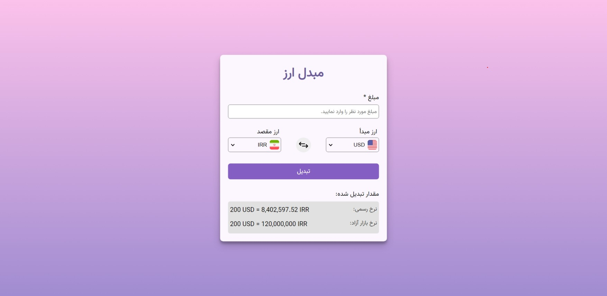

# Frontend Mentor - Age calculator app solution

Welcome to the currency converter app! This app is built using React.

## Table of contents

- [Overview](#overview)
  - [Features](#features)
  - [Screenshot](#screenshot)
  - [Links](#links)
- [My process](#my-process)
  - [Built with](#built-with)
  - [Continued development](#continued-development)
  - [Useful resources](#useful-resources)
- [Author](#author)

## Overview

### Features

Users are able to:

- View the converted amount both in official and free market exchange rate after submitting a valid amount.
- View the country flag when a currency is selected.
- See from currency and to currency swap when switch icon is clicked
- Receive validation errors if:
  - input field is empty when the form is submitted
  - input field loses focus while it's empty
- View the optimal layout for the interface depending on their device's screen size
- See hover and focus states for all interactive elements on the page

### Screenshot

### Links

- Solution URL: [solution URL](https://your-solution-url.com)
- Live Site URL: [live site URL](https://your-live-site-url.com)

## My process

### Built with

- Semantic HTML5 markup
- CSS custom properties
- Flexbox
- Mobile-first workflow
- [React](https://reactjs.org/) - JS library

### Continued development

Currently this app only converts dollar to iranian rial and vice versa. It can be later expanded to support more currency exchanges.

### Useful resources

- [ExchangeRate API](https://www.exchangerate-api.com/) - Used this API for fetching dynamic official currency exchange rates.
- For the free market currency exchange, a static currency exchange rate is used.

## Author

- LinkedIn - [Hale Sheikhi](https://www.linkedin.com/in/hale-sheikhi/)
- Frontend Mentor - [@halelite](https://www.frontendmentor.io/profile/halelite)
